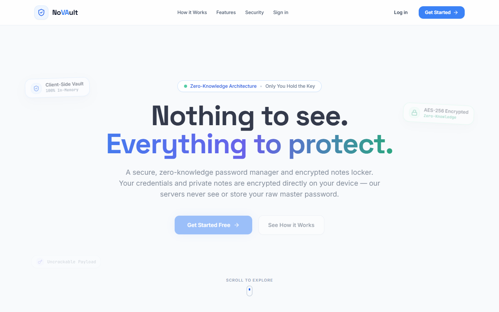
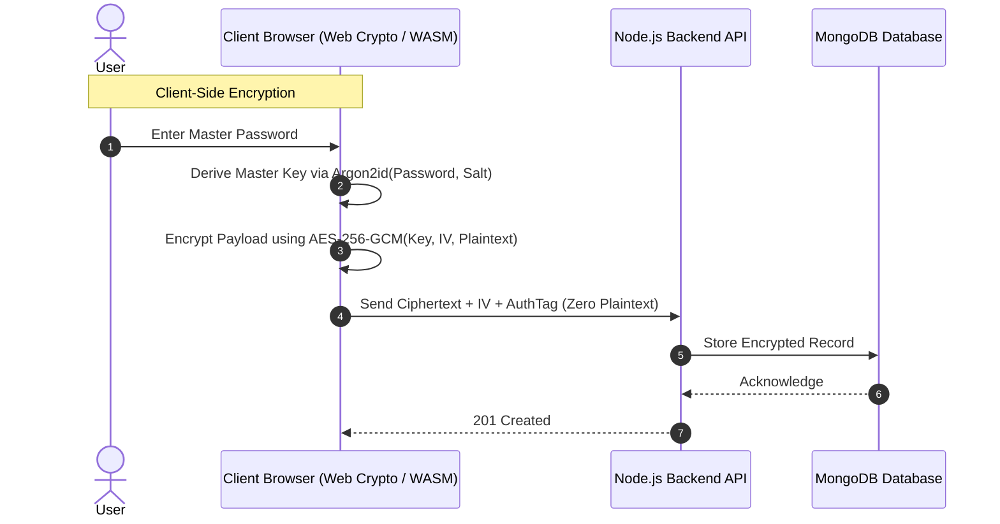

# NoVAult — Zero-Knowledge Password Manager & Secure Vault

[](https://novault.vercel.app)
[](https://react.dev/)
[](https://www.typescriptlang.org/)
[](https://nodejs.org/)
[](https://www.mongodb.com/)
[](https://en.wikipedia.org/wiki/Galois/Counter_Mode)

A modern, full-stack zero-knowledge password manager and digital security vault. All credentials, passwords, and sensitive notes are encrypted client-side using **AES-256-GCM** with keys derived via **Argon2id** from your Master Password — guaranteeing that plaintext secrets never touch server memory or databases.

---

## Live Demo

Experience the live application:
**[https://novault.vercel.app](https://novault.vercel.app)**

---

## UI Preview



---

## Key Features

### 1. True Zero-Knowledge Security Model
- **Client-Side Cryptography:** Data encryption and decryption occur exclusively inside the client browser.
- **Key Derivation (Argon2id):** The Master Password is fed into the memory-hard Argon2id key derivation function with an individual cryptographic salt to derive the Master Encryption Key.
- **Authenticated Encryption (AES-256-GCM):** High-speed Galois/Counter Mode guarantees both confidentiality and data integrity, thwarting tampering attacks.
- **Zero Server Knowledge:** The backend database strictly stores ciphertext, initialization vectors (IV), and authentication tags. Even in a complete database breach, zero credentials can be deciphered.

### 2. Vault Management & Organization
- **Credential Storage:** Store logins, credit cards, secure notes, and multi-factor recovery keys.
- **Strength Analyzer & Generator:** Configurable entropy-based password generator with real-time strength evaluation.
- **Folders & Tags:** Group items into logical vaults, categories, and favorites.

### 3. Authentication & Session Security
- **Dual-Token Architecture:** Short-lived access JWTs paired with secure, HTTP-only refresh tokens rotated on every renewal.
- **Multi-Factor Auth & OAuth:** Support for Google OAuth and Email OTP verification powered by Resend.
- **Inactivity Auto-Lock:** Automatic vault locking upon inactivity to prevent unauthorized physical terminal access.

---

## Cryptographic Architecture



---

## Tech Stack

| Layer | Technologies |
|---|---|
| **Frontend Client** | React 18, TypeScript, Vite, Tailwind CSS, Framer Motion, Lucide Icons |
| **State & Data Fetching** | TanStack Query (React Query), React Hook Form, Zod schema validation |
| **Cryptography** | Web Cryptography API, AES-256-GCM, Argon2id WASM |
| **Backend API** | Node.js, Express, TypeScript, Helmet, CORS, Rate Limiting |
| **Database** | MongoDB Atlas, Mongoose ODM |
| **Authentication** | JWT (Access + HTTP-only Refresh rotation), Google OAuth, Resend Email OTP |
| **Deployment** | Vercel (Client), Render (API Server), MongoDB Atlas (Database) |

---

## Getting Started

### Prerequisites
- Node.js 18.x or higher
- MongoDB instance (local or MongoDB Atlas connection URI)
- Resend API key (for transactional OTP emails)

### 1. Clone & Install
```bash
git clone https://github.com/mizan989/NoVAult-Password_Manager.git
cd NoVAult-Password_Manager
```

Install dependencies for client and server:
```bash
cd client && npm install
cd ../server && npm install
```

### 2. Environment Variables

**Server (`server/.env`):**
```env
PORT=5000
MONGODB_URI=your_mongodb_connection_string
JWT_ACCESS_SECRET=your_jwt_access_secret
JWT_REFRESH_SECRET=your_jwt_refresh_secret
CLIENT_URL=http://localhost:5173
RESEND_API_KEY=your_resend_api_key
```

**Client (`client/.env`):**
```env
VITE_API_URL=http://localhost:5000/api
```

### 3. Run Locally
```bash
# Terminal 1 - Server
cd server && npm run dev

# Terminal 2 - Client
cd client && npm run dev
```
- Client: `http://localhost:5173`
- Server: `http://localhost:5000`
