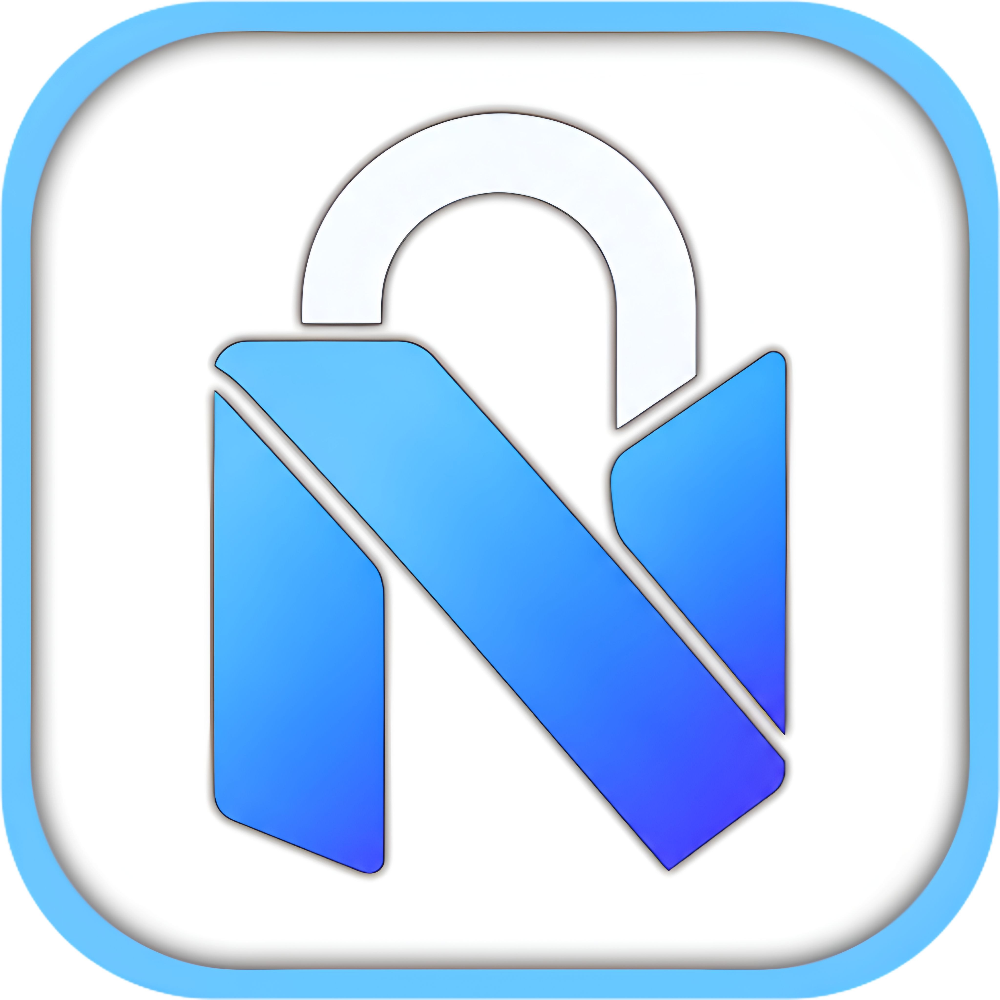
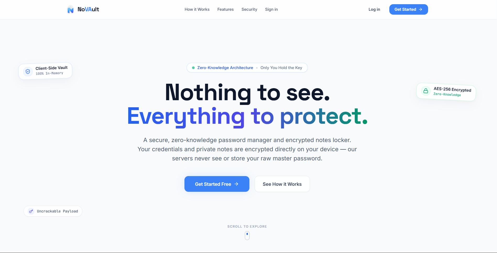
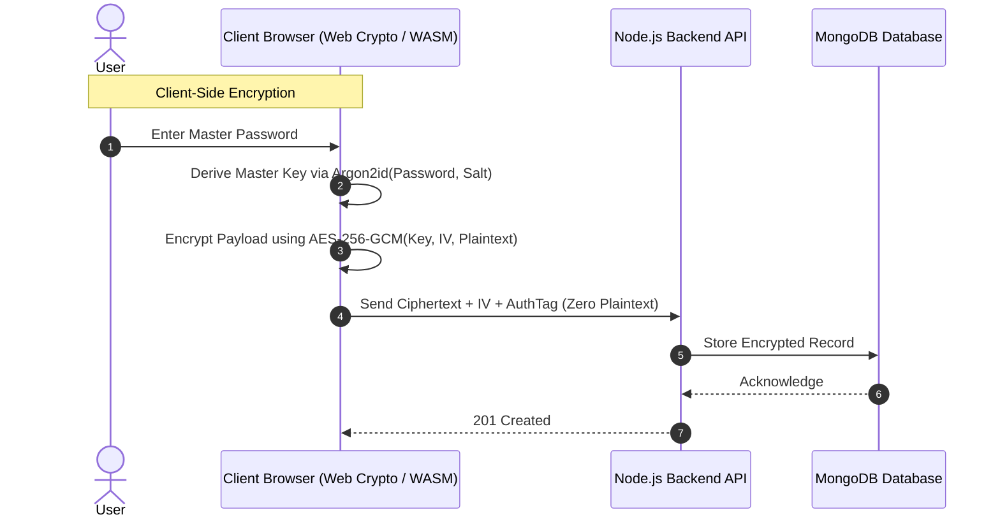

<p align="center">
  <a href="https://github.com/mizan989/NoVAult-Password_Manager">
    
  </a>
</p>

<div align="center">

# NoVAult

### The open-source zero-knowledge password manager & encrypted digital vault. Mathematical privacy where credentials are encrypted client-side using Argon2id & AES-256-GCM before ever leaving your browser.

<br/>

<a href="#-quick-start"></a>
<a href="https://novault.vercel.app"></a>
<a href="https://github.com/mizan989/NoVAult-Password_Manager/discussions"></a>

<a href="#-ways-to-run-novault"></a>
<a href="https://novault.vercel.app"></a>

<a href="https://github.com/mizan989/NoVAult-Password_Manager/stargazers"></a>
<a href="LICENSE"></a>
<a href="https://react.dev"></a>
<a href="https://www.typescriptlang.org"></a>
<a href="https://nodejs.org"></a>
<a href="https://www.mongodb.com"></a>
<a href="https://en.wikipedia.org/wiki/Galois/Counter_Mode"></a>

</div>

> [!TIP]
> **Zero-Knowledge Live Demo Ready!** Experience fully functional client-side encryption, real-time key derivation, and the interactive crypto simulator live at **[novault.vercel.app](https://novault.vercel.app)** — [Get started locally in under 60 seconds](#-quick-start).

---

## NoVAult Overview

NoVAult is a full-stack, open-source zero-knowledge password management platform and encrypted digital vault. Engineered to replace opaque, closed-source password managers, NoVAult operates on a strict zero-knowledge security architecture: all credentials, passwords, and sensitive notes are encrypted and decrypted exclusively in volatile client browser memory using **AES-256-GCM** with master keys derived via **Argon2id**.

The backend API and MongoDB database strictly store encrypted ciphertext, initialization vectors (IV), and cryptographic authentication tags. Even under total database breach or infrastructure compromise, your secrets remain mathematically impenetrable without your private Master Password.

**Key Capabilities:**

- **Client-Side Cryptography** — Data encryption and decryption occur solely in browser memory via Web Cryptography API and Argon2id WASM
- **True Zero-Knowledge Guarantee** — Decryption keys and plaintext passwords never touch the network, server logs, or database records
- **Memory-Hard Key Derivation** — Master passwords pass through salted Argon2id derivation to neutralize ASIC and brute-force GPU attacks
- **Authenticated Encryption (AES-256-GCM)** — Galois/Counter Mode guarantees both absolute confidentiality and authenticated data integrity
- **Ephemeral Session Security** — Master keys exist only in volatile RAM during active sessions and are wiped immediately upon auto-lock or logout
- **Dual-Token Authentication** — Short-lived access JWTs paired with HTTP-only rotating refresh tokens and Google OAuth integration
- **Curated Apple & Linear-Inspired UX** — Crisp typography, responsive bento layouts, command palette (`⌘K`), and fluid micro-interactions

<br>

<div align="center">
  <pre>
┌─────────────────────────────────────────────────────────────────────────────────┐
│                                    NOVAULT                                      │
│     Master Key ➔ Argon2id Salt ➔ AES-256-GCM ➔ Zero-Knowledge Payload           │
├───────────────────────────────┬─────────────────────────────────────────────────┤
│  🔐 Client-Side Cryptography   │  🛡️ Authenticated Ciphertext Tag               │
│   • Argon2id WASM derivation  │    [Encrypted Vault Record]                     │
│   • Memory-hard parameters    │       ├── Ciphertext (AES-256-GCM payload)      │
│   • Ephemeral RAM-only state  │       ├── 96-bit Initialization Vector (IV)     │
├───────────────────────────────┼─────────────────────────────────────────────────┤
│  ⚡ Zero-Knowledge Trust Model │  🔄 Dual-Token Session Security                 │
│   • 0 plaintext server storage│    • Short-lived Access JWT (15 min)            │
│   • Unrecoverable by design   │    • HTTP-Only Rotating Refresh Token           │
└───────────────────────────────┴─────────────────────────────────────────────────┘
  </pre>
</div>

---

## UI Preview

<p align="center">
  
</p>

---

## Cryptographic Sequence Flow


```mermaid
sequenceDiagram
    autonumber
    actor User
    participant Browser as Client Browser (Web Crypto / WASM)
    participant Server as Node.js Backend API
    participant DB as MongoDB Database

    Note over User,Browser: Client-Side Encryption
    User->>Browser: Enter Master Password
    Browser->>Browser: Derive Master Key via Argon2id(Password, Salt)
    Browser->>Browser: Encrypt Payload using AES-256-GCM(Key, IV, Plaintext)
    Browser->>Server: Send Ciphertext + IV + AuthTag (Zero Plaintext)
    Server->>DB: Store Encrypted Record
    DB-->>Server: Acknowledge
    Server-->>Browser: 201 Created
```

---

## Use Cases

- **Personal Credential Vault** — Store logins, usernames, passwords, and multi-factor recovery codes with instant one-click copy
- **Encrypted Secure Notes** — Keep confidential medical records, sensitive documents, and seed phrases encrypted at rest
- **High-Entropy Password Generation** — Generate cryptographically secure passwords with configurable length, character sets, and entropy scores
- **Zero-Knowledge Organization** — Categorize secrets with custom tags, vault categories, and instant global search via Command Palette (`⌘K`)
- **Security Audit & Password Health** — Real-time password strength analyzer warning against weak, reused, or common patterns

---

## 🚀 Quick Start

**Prerequisites:**
- Node.js 18.x or higher
- MongoDB instance (local MongoDB or free MongoDB Atlas URI)
- *(Optional)* Resend API key (for transactional OTP verification emails)

### Installation & First Run

```bash
# 1. Clone the repository
git clone https://github.com/mizan989/NoVAult-Password_Manager.git
cd NoVAult-Password_Manager

# 2. Install dependencies for both client and server
cd client && npm install
cd ../server && npm install
cd ..

# 3. Configure environment variables
# Copy server config
cp server/.env.example server/.env
# Copy client config
cp client/.env.example client/.env

# 4. Start development servers
# Terminal 1 - Server
cd server && npm run dev

# Terminal 2 - Client
cd client && npm run dev
```

Open **[http://localhost:5173](http://localhost:5173)** in your browser to start using NoVAult.

> [!NOTE]
> When setting up your master password for the first time, make sure to memorize it. Because NoVAult operates on mathematical zero-knowledge privacy, lost master passwords **cannot** be recovered or reset by administrators.

---

## Ways to Run NoVAult

- **Live Cloud Production** — Hosted live on Vercel (Client) and Render (API Server) with MongoDB Atlas. [Try Live App](https://novault.vercel.app)
- **Local Full-Stack Development** — Runs with hot-reloading using Vite and Express with your local MongoDB instance. [Quick Start](#-quick-start)
- **Production Self-Hosted Bundle** — Compile the client into static assets (`npm run build`) and serve via Nginx, Caddy, or Node.

---

## ☁️ Vault Workspaces & Views

NoVAult delivers dedicated interfaces tailored for secure credential management:

- **Interactive Landing & Crypto Simulator (`/`)** — Interactive demonstration illustrating client-side encryption vs. server ciphertext in real time.
- **Master Password Unlock (`/unlock` & `/master-password`)** — High-security master key derivation workspace utilizing memory-hard Argon2id parameters.
- **Vault Dashboard (`/dashboard`)** — Overview of stored credentials, vault health score, quick actions, and recent activity.
- **Passwords Vault (`/vault`)** — Full credentials manager with category filters, search, favorites, and secure reveal/copy controls.
- **Encrypted Notes Studio (`/notes`)** — Dedicated private notepad for encrypted free-form text, recovery keys, and sensitive memos.
- **Entropy Password Generator (`/generator`)** — Customizable entropy generator with real-time strength meter and cryptographic randomness.
- **Security & Privacy Settings (`/settings`)** — Session management, master password rotation, account security, and audit parameters.

---

## ✨ Features

### True Zero-Knowledge Security Model

NoVAult's architecture guarantees that only you possess the keys to your sensitive information:

```text
User Master Password
        │
        ▼
[1. Salted Argon2id Derivation]  ── Generates 256-bit Master Encryption Key
        │
        ▼
[2. AES-256-GCM Encryption]      ── Produces Ciphertext + 96-bit IV + Auth Tag
        │
        ▼
[3. Zero-Knowledge Network Wire] ── Only ciphertext touches HTTPS payload
        │
        ▼
[4. Encrypted Database Storage]  ── Database stores only unreadable ciphertext
```

### Ephemeral In-Memory Decryption
- **Volatile RAM Only** — Decrypted credentials reside exclusively in volatile JavaScript runtime memory and are never written to `localStorage` or `IndexedDB`.
- **Auto-Lock Timeout** — Automatic session termination and memory flush upon inactivity to safeguard against unattended device tampering.
- **Instant Manual Lock** — One-click vault lockdown clears master keys and returns the application to its protected lock screen.

### Modern Full-Stack Tech Stack

| Layer | Technologies |
|---|---|
| **Frontend Client** | React 18, TypeScript, Vite, Tailwind CSS, Framer Motion, Lucide Icons |
| **State & Data Fetching** | TanStack Query (React Query), React Hook Form, Zod schema validation |
| **Cryptography** | Web Cryptography API, AES-256-GCM, Argon2id WASM |
| **Backend API** | Node.js, Express, TypeScript, Helmet, CORS, Rate Limiting |
| **Database** | MongoDB Atlas, Mongoose ODM |
| **Authentication** | JWT (Access + HTTP-only Refresh rotation), Google OAuth, Resend Email OTP |
| **Deployment** | Vercel (Client), Render (API Server), MongoDB Atlas (Database) |

---

## ⚙️ Configuration

### Server Environment (`server/.env`)

```env
PORT=5000
MONGODB_URI=your_mongodb_connection_string
JWT_ACCESS_SECRET=your_jwt_access_secret_key
JWT_REFRESH_SECRET=your_jwt_refresh_secret_key
CLIENT_URL=http://localhost:5173
RESEND_API_KEY=your_resend_api_key
```

### Client Environment (`client/.env`)

```env
VITE_API_URL=http://localhost:5000/api
```

---

## Backend Keep-Alive & Cold-Start Prevention

### Why This is Needed
The NoVAult backend API is hosted on **Render's Free Tier**. Under Render's free tier architecture:
- Web services automatically spin down (sleep) after **15 minutes** of HTTP inactivity.
- When an inactive server receives a request, it undergoes a **cold-start spin-up lasting 30–50+ seconds**, resulting in noticeable delays for initial login and vault load times.

### How It Works
To prevent sleep mode and eliminate cold-start latency, a scheduled GitHub Actions workflow ([`.github/workflows/keep-alive.yml`](.github/workflows/keep-alive.yml)) is configured:
1. **Automated Cron Schedule (`*/10 * * * *`):** Triggers every 10 minutes—comfortably within Render's 15-minute inactivity window.
2. **Lightweight Health Ping:** Sends a non-blocking HTTP `GET` request to `https://novault-mizan.onrender.com/health`.
3. **Inactivity Timer Reset:** Each ping resets Render's idle countdown, keeping the container warm and immediately responsive 24/7.
4. **Cold-Start Resilience & Diagnostics:** Includes a 60-second timeout (`--max-time 60`), 2 automated retries (`--retry 2`), and structured console logging reporting HTTP status codes and response times.

> [!TIP]
> Free external monitoring services like **[UptimeRobot](https://uptimerobot.com)** or **[Cron-job.org](https://cron-job.org)** can also be pointed to `https://novault-mizan.onrender.com/health` every 10 minutes as a standalone alternative without consuming GitHub Actions queue minutes.

---

## Architecture & Code Structure

```text
NoVAult/
├── client/
│   ├── public/
│   │   └── logo.png           # Canonical vector-grade application logo & favicon
│   ├── src/
│   │   ├── components/        # Auth, Layout, UI primitives, Landing, Vault modals
│   │   ├── hooks/             # useAuth, useVaultUnlock, useToast
│   │   ├── pages/             # Landing, Dashboard, Vault, Notes, Generator, Settings
│   │   ├── services/          # api.ts, authService.ts, vaultService.ts
│   │   ├── utils/             # crypto.ts (AES-256-GCM + Argon2id), passwordStrength.ts
│   │   └── types/             # VaultItem, User, Cryptographic payload schemas
│   ├── index.html             # HTML root with typography & favicon configuration
│   └── vite.config.ts         # Vite bundler setup
│
├── server/
│   ├── src/
│   │   ├── config/            # Database & environment variables
│   │   ├── controllers/       # authController, vaultController, userController
│   │   ├── middleware/        # auth, rateLimiter, errorHandler
│   │   ├── models/            # User.ts, VaultItem.ts
│   │   ├── routes/            # authRoutes, vaultRoutes, userRoutes
│   │   └── index.ts           # Express server entry point
│   └── package.json           # Backend dependencies and scripts
│
└── assets/
    └── screenshot.png         # High-resolution dashboard application preview
```

---

## ☁️ Cloud Deployment

Deploy NoVAult to your preferred cloud providers:

### Client (Vercel)
```bash
cd client
npm i -g vercel
vercel
```
Set `VITE_API_URL` to your production backend API URL in the Vercel Dashboard.

### Server (Render / Railway / VPS)
Deploy `server` as a Node Web Service:
- **Build Command:** `npm install && npm run build`
- **Start Command:** `npm start`
- Provide `MONGODB_URI`, `JWT_ACCESS_SECRET`, `JWT_REFRESH_SECRET`, and `CLIENT_URL` environment variables.

---

## Verification & Quality Bar

```bash
# Typecheck client TypeScript code
cd client && npm run build

# Typecheck server TypeScript code
cd server && npm run build
```

---

## Contributing

We welcome contributions! Whether you're enhancing cryptographic primitives, improving client accessibility, or adding new vault features:

1. Fork the repository
2. Create your feature branch (`git checkout -b feature/biometric-webauthn`)
3. Commit your changes (`git commit -m 'Add WebAuthn biometric unlock support'`)
4. Push to the branch (`git push origin feature/biometric-webauthn`)
5. Open a [Pull Request](https://github.com/mizan989/NoVAult-Password_Manager/pulls)

---

## Support the Project

**Enjoying NoVAult?** Give us a ⭐ on [GitHub](https://github.com/mizan989/NoVAult-Password_Manager) to help spread open-source, zero-knowledge privacy!

---

## Acknowledgements

NoVAult is built with gratitude towards the open-source security and developer ecosystem:

- [React](https://react.dev/) & [Vite](https://vitejs.dev/) — Lightning-fast frontend tooling and runtime
- [Tailwind CSS](https://tailwindcss.com/) — Utility-first aesthetic styling engine
- [Lucide Icons](https://lucide.dev/) — Clean, consistent UI iconography
- [Argon2id](https://github.com/P-H-C/phc-winner-argon2) & [Web Cryptography API](https://www.w3.org/TR/WebCryptoAPI/) — Battle-tested cryptographic primitives
- [Express](https://expressjs.com/) & [MongoDB](https://www.mongodb.com/) — Robust backend API and persistence layer
- [Framer Motion](https://www.framer.com/motion/) — Fluid spring animations and interactive layout transitions

<div align="center">

> [!NOTE]
> **Zero-Knowledge Security Disclaimer:** NoVAult is designed with defense-in-depth principles. Because decryption keys are derived client-side from your master password, always choose a strong, unique master password and maintain physical device security.

</div>
